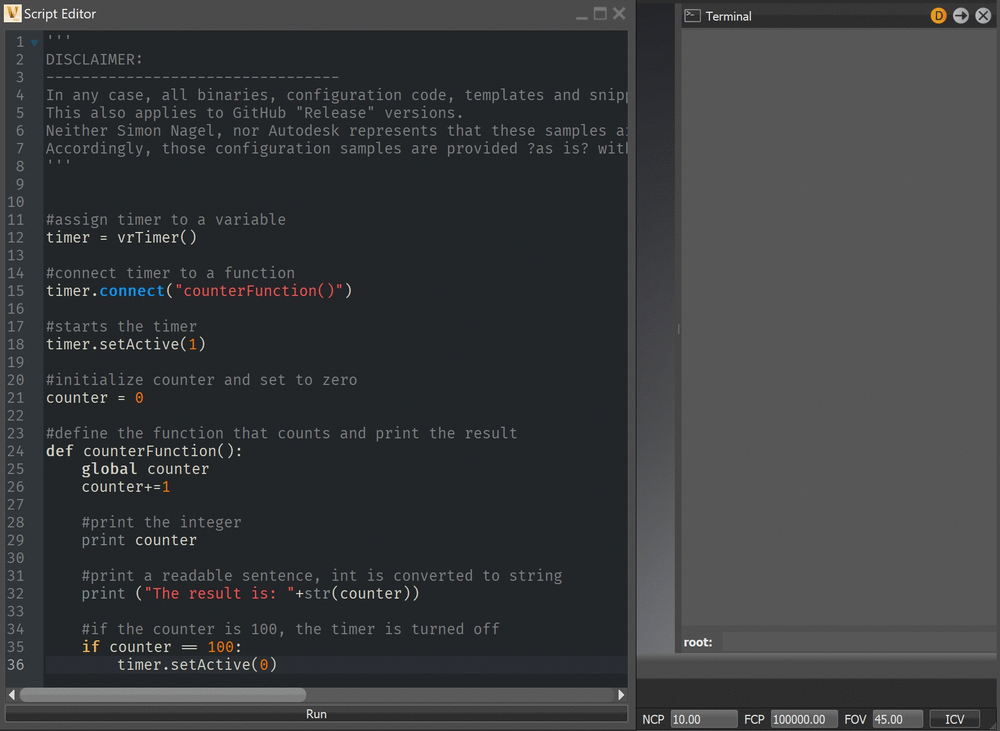

# VRED-vrTimer
## Collection of Examples on how to use the vrTimer in VRED
General Usage:
Use the vrTimer if you want to create realtime interactions with your VRED scene. 
The vrTimer can execute functions at any rendered frame or in a defined timer.
- vrTimer() - timer will be executed on every rendered frame
- vrTimer(1) - timer will be executed every second
- vrTimer(0.04) -timer will be executed 25 times per second

vrTimer needs to be connected to a function and can be started and stopped.
This can look like:
```
timer = vrTimer()
timer.connect("yourFunction()")
timer.setActive(1)

def yourFunction():
    print "test"
```

### vrTimer-counter:
Simple Example on how to use the counter to count until 100



### vrTimer-syncZPosToObj:
Simple Example on how to sync the Z Position between two objects


### vrTimer-drivenKey:
Simple Example on how to setup a driven key. The x Translation of the car is used to calculated the Y Rotation of the Wheel.


### vrTimer-actionBasedOnDistance:
Simple Example on how create action based on distance between objects. In this scenario a variant is executed if certain distance values are reached


